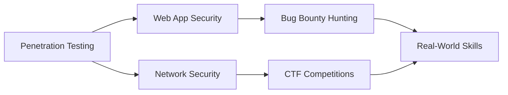

# 👾 Syed Mujtaba Zaidi

<div align="center">
  
  
  
  [](https://mujtaba11riu.github.io/)
  [](https://www.linkedin.com/in/syedmujtaba773/)
  [](mailto:syedmujtaba773@gmail.com)
  
</div>

---

## 🎯 About Me

```python
class EthicalHacker:
    def __init__(self):
        self.name = "Syed Mujtaba Zaidi"
        self.role = "Cyber Security Enthusiast"
        self.location = "Rawalpindi, Pakistan"
        self.education = "BS Cyber Security @ Riphah International University"
        self.current_focus = ["Penetration Testing", "Bug Bounty", "CTF Competitions"]
        self.motto = "H4X0R S1NC3 2O21"
    
    def get_expertise(self):
        return {
            "offensive_security": ["Web Exploitation", "Network Pentesting", "Reverse Engineering"],
            "defensive_security": ["Security Auditing", "Vulnerability Assessment"],
            "programming": ["C++", "Java", "Python", "Bash"],
            "platforms": ["Linux", "Kali", "TryHackMe", "HackTheBox"]
        }
```

🔐 **Currently:** DevSecOps Intern @ PHI Consulting  
🎓 **Pursuing:** BS in Cyber Security (Expected 2028)  
🏆 **Achievement:** Top 6 Finalist - Air CTF 2025 | Team StealthWorm

---

## 🏅 Recent Achievements

<table>
  <tr>
    <td align="center" width="50%">
      
      <br><sub><b>Competed against NUST, GIKI, COMSATS</b></sub>
    </td>
    <td align="center" width="50%">
      
      <br><sub><b>Team: TH3 S1L3NT D3STROY3R</b></sub>
    </td>
  </tr>
  <tr>
    <td align="center" width="50%">
      
      <br><sub><b>FAST-NUCES Islamabad</b></sub>
    </td>
    <td align="center" width="50%">
      
      <br><sub><b>Reverse Eng, Web, Forensics, Crypto</b></sub>
    </td>
  </tr>
</table>

---

## 🛠️ Technical Arsenal

### 💻 Languages & Tools


### 🔒 Security & Platforms


### 🎖️ Certifications


---

## 📊 GitHub Stats

<div align="center">
  
  
  
  
</div>

<div align="center">
  
  
  
</div>

---

## 🚀 Featured Projects

<table>
  <tr>
    <td width="50%">
      <h3 align="center">WiFi Deauther (DLD)</h3>
      <p align="center">
        <a href="https://github.com/Mujtaba11Riu/WiFi-Deauther-DLD-Project" target="_blank">
          
        </a>
      </p>
      <p align="center">Deauthentication simulation for academic research & Wi-Fi security analysis</p>
    </td>
    <td width="50%">
      <h3 align="center">Meal Ordering System (OOP)</h3>
      <p align="center">
        <a href="https://github.com/Mujtaba11Riu/Meal-Ordering-System-Java" target="_blank">
          
        </a>
      </p>
      <p align="center">Advanced Java project implementing core OOP concepts</p>
    </td>
  </tr>
</table>

---

## 🎓 Current Learning Path



- 🔍 Advanced Web Application Penetration Testing
- 🐧 Linux Privilege Escalation Techniques
- 🔐 Cryptography & Reverse Engineering
- 🏴‍☠️ Active Bug Bounty Programs

---

## 💼 Professional Experience

**DevSecOps Intern** @ PHI Consulting *(Current)*  
**Visiting Manager** @ Khoraak Khaana *(Weekend Operations)*  
**Manager & Cashier** @ ZAMO Shawarma *(2 Years)*

---

## 🌐 Connect & Collaborate

<div align="center">
  
  [](https://mujtaba11riu.github.io/)
  
  [](https://www.linkedin.com/in/syedmujtaba773/)
  [](https://github.com/Mujtaba11Riu)
  [](mailto:syedmujtaba773@gmail.com)
  [](https://wa.me/923118334874)
  
</div>

---

<div align="center">
  
### 💀 "The best way to predict the future is to invent it - or hack it responsibly." 💀
  
  
  
  **© 2025 Syed Mujtaba Zaidi | H4X0R S1NC3 2O21**
  
</div>
